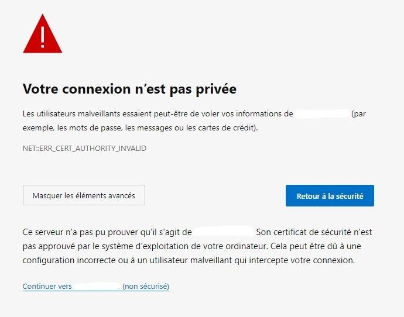
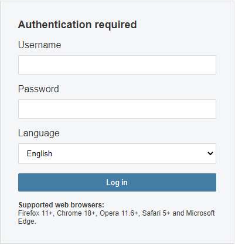
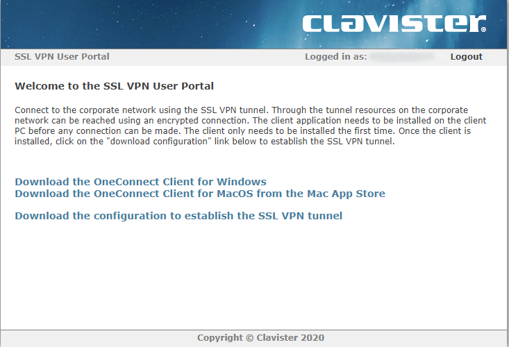

# Installation du VPN

## **INSTALLATION**

### Internet Explorer

* Rendez-vous sur l’adresse du site internet qui vous a été communiquée par mail\

* Cliquez sur la flèche .png>) à côté du lien "informations"&#x20;

.png>)

* Cliquez sur le lien **"Accéder à la page web (non recommandé)"**&#x20;

.png>)

### Mozilla Firefox

* Rendez-vous sur l’adresse du site internet qui vous a été communiquée par mail\

* Cliquez sur le bouton "**Avancé…**"

.png>)

* Cliquez sur le bouton "**Accepter le risque et poursuivre**"

.png>)

### Google Chrome

* Rendez-vous sur l’adresse du site internet qui vous a été communiquée par mail
* Cliquez sur le bouton "**Paramètres avancés**"

.jpeg>)

* Cliquez sur le bouton "**Continuer sur le site…(dangereux)** "

.png>)

### Microsoft Edge

* Rendez-vous sur l’adresse du site internet qui vous a été communiquée par mail\

* Cliquer sur le bouton "**Avancé**"

.jpeg>)

* Cliquez sur le bouton "**Continuer vers…(non sécurisé)**"

## **TELECHARGEMENT DES FICHIERS**

* Saisissez l’identifiant et mot de passe qui vous ont été communiqués par mail.

* Téléchargez le fichier d’installation (Setup\_SSLVPN) en cliquant :
  * Sur le premier lien si vous souhaitez l’installer sur un ordinateur Windows
  * Sur le second lien si vous souhaitez l’installer sur un ordinateur MAC
* Cliquez ensuite sur le troisième lien afin de télécharger le raccourci qui vous servira à lancer le VPN.

* Une fois téléchargé, renommez ce fichier (sslvpn\_config) en **"VPN NOMENTREPRISE"** et déplacez-le, de préférence, sur votre bureau

**IMPORTANT** : Afin d’exécuter correctement votre logiciel VPN il est impératif de **toujours** l’ouvrir à partir du fichier raccourci téléchargé précédemment (2).

En effet, ce raccourci/fichier de configuration, permet de remplir automatiquement les différentes informations nécessaires afin de vous connecter au réseau de votre entreprise (nom d’utilisateur, adresse IP et port).

## **INSTALLATION ET**&#x20;

* Exécutez le fichier d’installation téléchargé nommé **"Setup\_SSLVPN.exe"** afin d’installer le logiciel VPN
