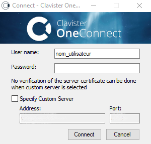

# Connexion au VPN

Une fois le logiciel installé, exécutez-le depuis le fichier raccourci que vous avez renommé précédemment en **"VPN NOMENTREPRISE"** 

* La fenêtre ci-dessus s’ouvre
* Vérifiez que le nom d’utilisateur (User name) correspond bien à celui qui vous a été communiqué par mail
* Renseignez le mot de passe (Password) qui vous a été communiqué par mail puis cliquez sur le bouton **"Connect"**
* Si les notifications sont actives sur votre PC, le message ci-dessous indique que vous êtes bien connecté au VPN :

* Une fois la connexion établie, votre ordinateur a accès au réseau de votre entreprise.
